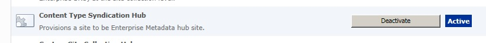
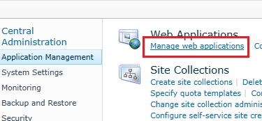
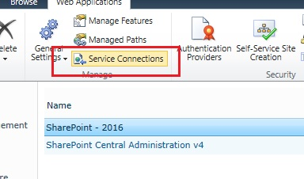
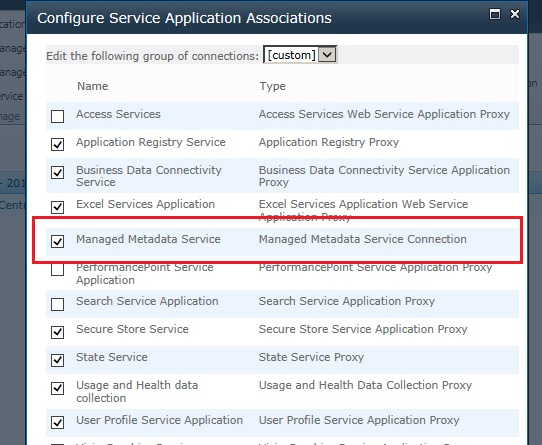
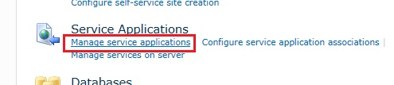
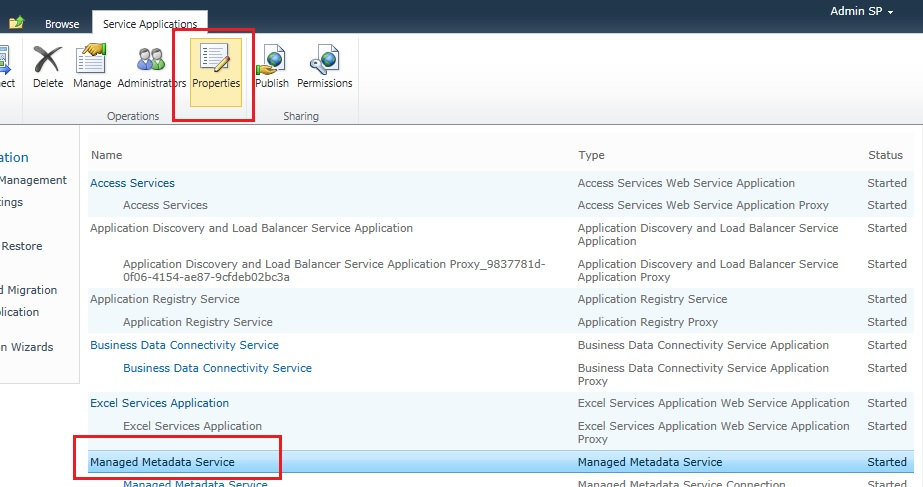
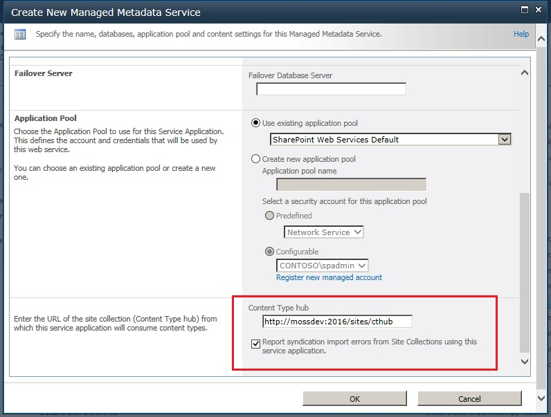
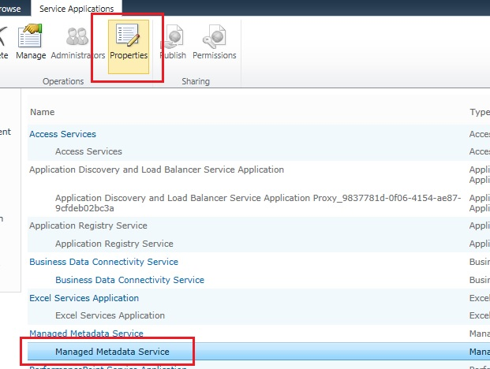
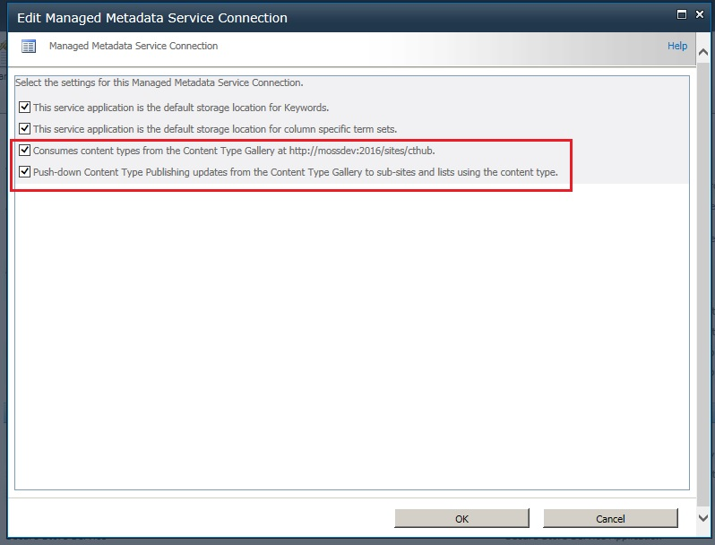

## Content Type Hub (二)配置 ##

在上周我们用简单的篇幅大致介绍了一下从SP2010 开始新增的这个功能,那么以下的内容将会告诉大家如何在SP的Farm中配置一个Content Type Hub.

#### 准备工作 ####
- 首先你要有一个SP的环境
- 假设基本的配置已经完成,包括Managed Metadata Service 的创建已经完成
- 创建了一个Web Application 和2个Site Collection. 其中一个将做为Content Type Hub
- 由于本次的几乎所有操作都可以通过SP提供的UI来完成,所以不需要Visual Studio. 在个别情况下会用到Powser Shell for SharePoint. 后文会详细说明.

#### 开始吧 ####

#####Step1 - 声明为Content Type Hub#####
首先我们来到作为Content Type Hub 的Site Collection,在Site Collection Feature 的管理界面中找到并且激活以下Feature(这个Feature默认情况下是停用的)

#####Step2 - 确认WebApplication 所关联的Managed Metadata Service#####
*注意:Step2 对与在Farm中只有一个Managed Metadata Service 的环境来说可以忽略*

首先我们确认一下在Step1 中的SC所关联的Managed Metadata Service. 这一步对与在同一个Farm中有多个MMS的情况来说是必要的. 我们来到管理中心的 web applications 管理界面

选中需要确认的WebApplication 并且点击Ribbon上的Service Connections 按钮

在弹出窗口中,确认和当前WebApplication 关联的 Managed Metadata Service 是哪一个,记下名字后关闭窗口.

####Step3 - 在Managed Metadata Service 中注册 Content Type Hub ####
在管理中心打开Service Application的管理页面

选中对应的Managed Metadata Service,并且点击Ribbon上的Properties按钮

在弹出的修改属性界面中,把Content Type Hub 的地址输入并且点击OK按钮进行保存

*注意:你只有一次机会用SharePoint提供的界面来修改Content Type Hub,一旦保存后,就无法再次用界面来修改了.*

还差一步就能完成了. 请选中MMS的Proxy并且点击Ribbon上的Properties按钮

在弹出的窗口中确认选中了第三第四个Checkbox,点击OK保存修改.

恭喜你,至此你已经在Farm中成功配置了Content Type Hub 了,你可以尽情的享用它带给你的便利了.是不是很激动?

好吧,我知道你还是一头雾水的在想,虽然已经配置好了,但是我怎么用起来呢? 哎,我就是那么善解人意.

可惜时间不早了,等下次我一定告诉你一些大家都想知道的的诀窍 ;)

