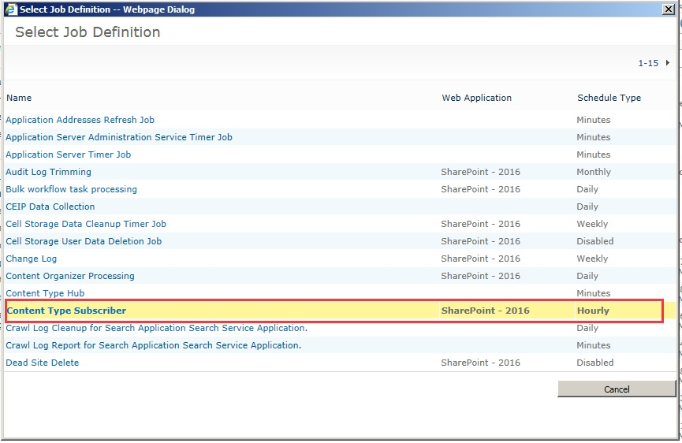
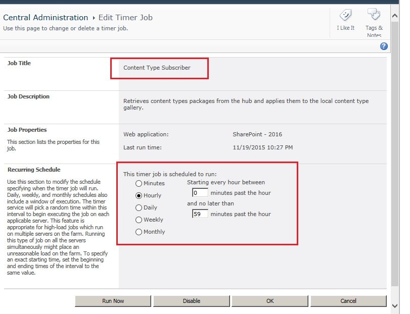
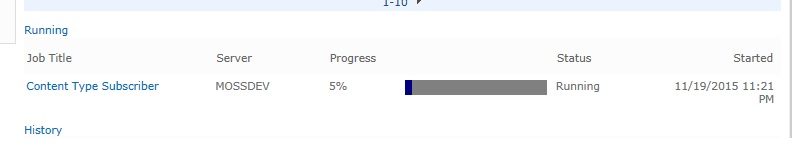
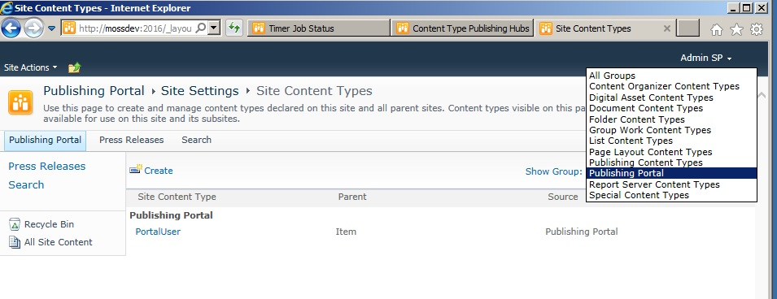

## Content Type Hub (三) 使用 ##

我们之前已经对Content Type Hub 做了简单的介绍,而且也用Step By Step 的方式介绍了如何在一个SharePoint Farm 中创建一个Content Type Hub. 那么接下来我们就能开始愉快的使用他了. 什么?你说你还不会?没关系,~~看完了今天的文章,包会~~下面我们就来看看如何愉快的使用Content Type Hub

#### 前提和准备工作 ####
- 假设你已经按照上一篇文章介绍的步骤,在你的SharePoint 环境中创建了一个Content Type Hub
- 假设你知道如何在SharePoint 中创建Content Type 以及了解和Content Type相关的操作.
 

#### 正式开始吧 ####

##### 创建Content Type #####
1. 
首先在Cotent Type Hub 站点中创建一个名为PortalUser 的Content Type, 继承自SharePoint 的Item Content Type,并且为了演示,我们将新创建一个组来存放我们自定义的Content Type, 组的名字叫Publishing Portal

2. 
点击OK按钮后,系统会出现选择Content Type 字段的界面.此时我们将事先创建的2个字段加入当前的Content Type

3. 
点击OK按钮保存Content Type. 此时可以看到我们新创建的Content Type

4. 与我们在其他站点上创建的Content Type 不同,你会注意到在设置项中有一项名字叫"Manage publishing for this content type".在Content Type Hub 站点上的Content Type 正是由这个选项来控制是否需要发布供其他站点使用.
我们点击这个设置来看看,你会发现如下图所示

5. 点击OK按钮来发布当前的Content Type.完成后你可以再次进入这个页面查看状态,此时如果没有意外的话,你会看到Unpublish 和Republish 已经可用.这2个选项帮助我们来控制Content Type 的更新与停用.

6. 此时其实我们已经开始使用Content Type Hub 所提供的服务了,不信的话请打开另一个Site Collection 查看之前创建的Content Type 是否已经出现在站点的Content Type 中了?
并没有?真的吗?请仔细看看....真的没有吗?

7. 好吧,其实这也是有可能的,当然很多情况下并不是出现了错误,因为如果你这个时候去喝杯水,抽根烟,踢场球什么的,回来再看看,十有八九已经能看到了.这是为什么呢?说到这里,相信不少熟悉SharePoint 开发的小伙伴已经猜到了,没错,因为Content Type Hub 的功能和Timer Job 有关系. 那我们下面来看看涉及到Content Type Hub 功能的Timer Job

##### Timer Job #####
在管理中心的"Timer Job Status" 页面中,我们根据"Job Definition"来过滤和寻找我们感兴趣的Job.
1. 第一个Job. 首先我们能够找到的是一个名为"Content Type Hub" 的Job.由于它并不关联具体的某一个Web Application, 所以当你根据Web Application 来过滤Job 状态的时候不会发现它.这个Job 主要负责Content Type 在发布过程中出错后记录相关的日志(用户可以在日志列表中看到所有发布错误的信息)以及其他一些状态的维护.我们这里为了演示,直接点击"Run Now"按钮让这个Job 立刻执行.

2. 第二个Job. 在切换Job Definition 的时候我们可以发现在第一个Job 的下面还有一个名字看上去和Content Type Hub 相关的Job. 这个看上去好像和Cotent Type 的同步关系更大一些,是吗?

3. 点击这个Job 的Name 查看最后一次运行的时间和状态. 刚才你没有看到由Content Type Hub 发布的Content Type 大多数原因正是因为这个Job 在你发布了Content Type 之后还没有运行过. 由Job 的定义我们看到它是一个以小时为间隔单位来运行的. 那我们为了演示,直接点击"Run Now"按钮让这个Job 立刻执行.

4. 刷新页面后你也许会看到这个Job 正在执行的状态,如下图

5. 成功执行后,我们来到Site Collection 的Content Type 管理页面,此时你应该可以看到由Content Type Hub 发布的Content Type 了.

##### 验证 Content Type#####
接下来我们来验证一下这个Content Type 在新的站点中是不是能够正常使用.

